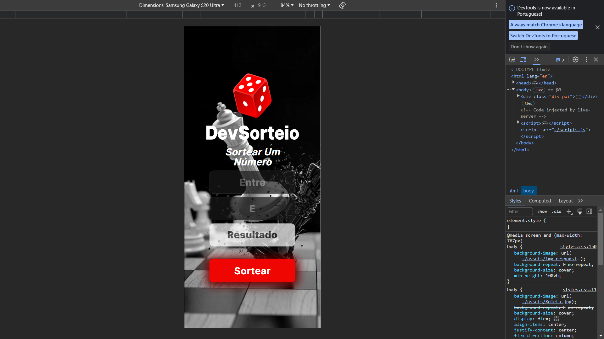

# Sorteador De Números
 
<a href="https://sorteador-de-numeros-th.netlify.app/">
 

Onde vc seleciona o valor minimo o máximo, e o sorteio acontece entre esses dois valores,
onde o valor minimo não pode ser maior que o valor máximo, se isso acontecer ele vai mostrar uma menssagem na tela dizendo que que o valor minimo tem que ser menor q do input de baixo,
 
tbm esta 100% responsivo.
 
Usei As Seguintes Tecnologias,
 

 
 
 

